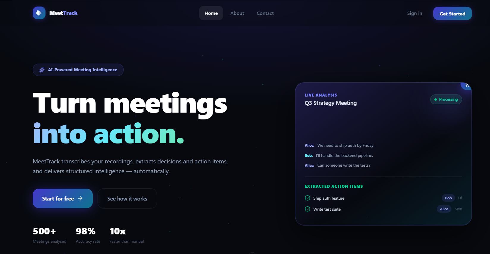
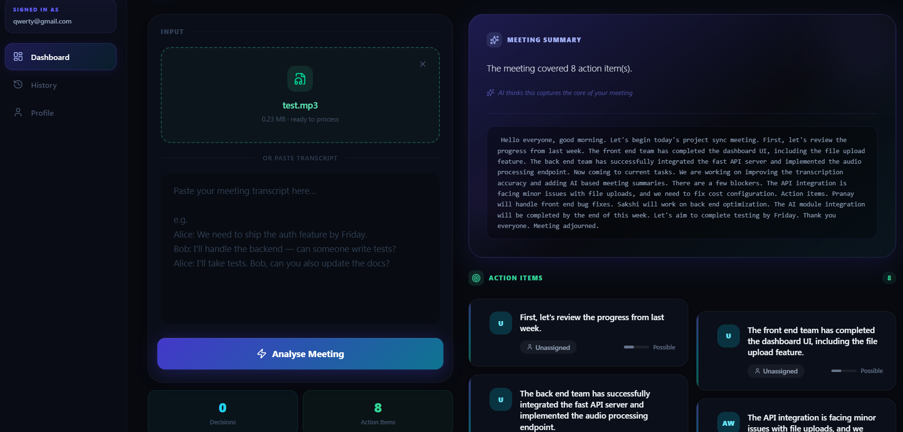
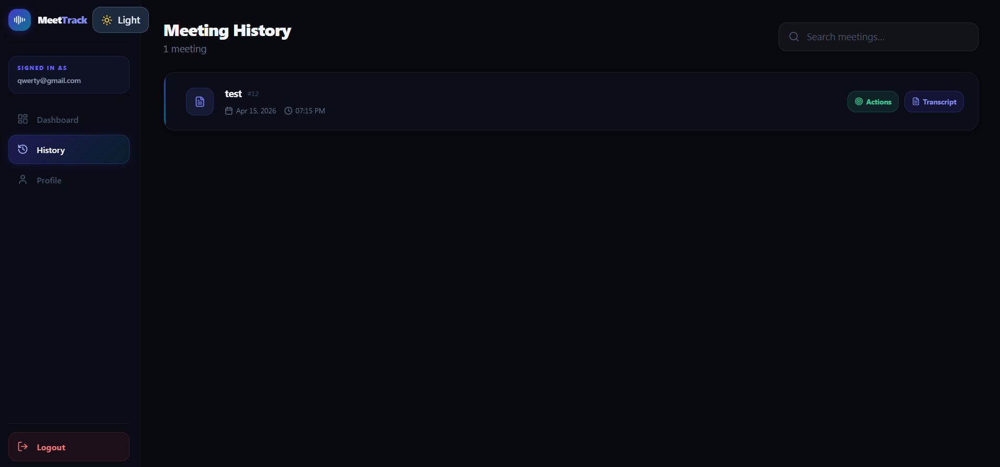
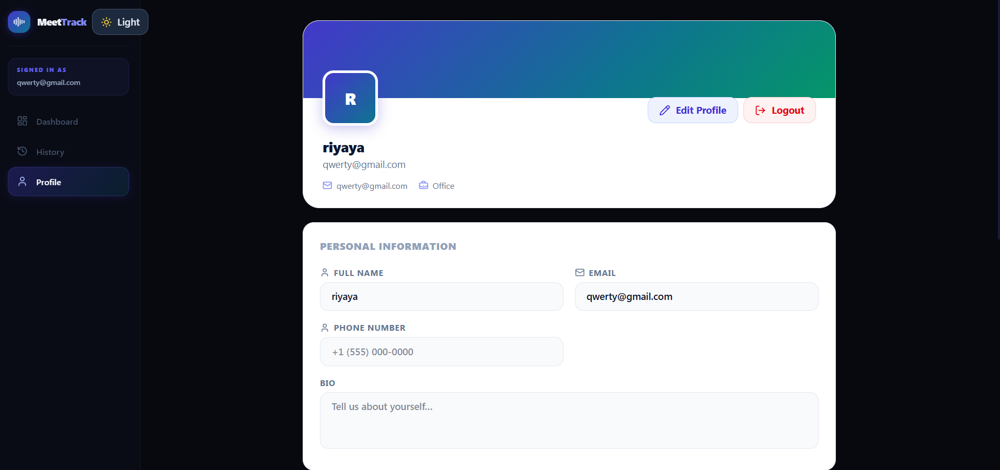

# 🚀 OutcomeX – AI Meeting Intelligence Platform

<p align="center">
Turn messy meetings into structured insights, decisions, and action items — automatically.
</p>

---

# 🏆 Badges

<p align="center">


</p>

---

# 🌟 Why This Project Stands Out

Most projects stop at “LLM summary.”
**OutcomeX goes beyond:**

* Multi-step AI pipeline (not a single API call)
* Production-grade backend (auth, DB, APIs)
* Real-world failure handling (fallbacks, retries)
* Automation integration (n8n)
* Polished frontend with advanced UI/UX

👉 This is what real AI products look like.

---
# 📸 Screenshots








---

# 🎥 Demo

[Demo ](https://outcomex-1.onrender.com)

---


# 🧠 AI / NLP Pipeline

### 🔄 Multi-Step Processing

```
Transcript → Clean → Speaker Detection → Key Sentence Extraction → LLM → Structured Output
```

* Removes noise from transcripts
* Detects speakers (`Alice:`, `[Bob]`)
* Extracts important sentences before LLM call
* Improves accuracy & reduces hallucination

---

### 🤖 Structured Output (Strict JSON)

```json
{
  "summary": "...",
  "decisions": ["..."],
  "action_items": [
    {
      "task": "...",
      "assignee": "...",
      "confidence": 0.87
    }
  ]
}
```

✔ No hallucinated fields
✔ Strict schema
✔ Production-safe parsing

---

### 🎯 Intelligence Features

* 🧑‍🤝‍🧑 Speaker detection
* 🧠 Implicit decision detection
* 📊 Confidence scoring (0.0–1.0)
* 🛠 Regex fallback (if AI fails)
* 🧑‍💼 Role-based prompting (Fortune 500 analyst style)

---

# ⚙️ Backend Features

## 🔐 Authentication

* JWT-based login / register
* Secure password hashing
* Configurable expiry

---

## 📡 API Endpoints

### Auth

* `POST /register`
* `POST /login`

### AI Processing

* `POST /audio`
* `POST /process`
* `POST /process-transcript`
* `POST /extract-tasks`

### Meetings

* `GET /meeting/`
* `GET /meeting/{id}`
* `GET /meeting/{id}/summary`

### Action Items

* `GET /action-items/?meeting_id=`
* `PUT /action-items/{id}/status`

### Profile

* `GET /profile/{id}`
* `PUT /profile/{id}`

---

## 🔗 n8n Integration

* Retry with exponential backoff (2s → 4s → 8s)
* Idempotency (SHA-256 keys)
* Webhook audit logs
* Debug endpoints for monitoring

---

## 🏗 Infrastructure

* PostgreSQL + SQLAlchemy
* CORS via env variables
* Graceful degradation (Whisper failure → 503)
* Fully Render deploy-ready

---
# 🔥 Why This Project is Different

Most projects:

* Simple chatbot
* Basic summarizer

OutcomeX:

* Real system design
* AI reliability engineering
* Production-ready architecture

---

# 🚀 Deployment Status

## ✅ Working on Render

* Auth system
* Transcript → AI → DB
* History & action items
* Profile
* n8n integration

## 🖥 Local Only

* Audio → Whisper → AI

---

# 💡 Architecture Highlights

* Multi-step AI pipeline
* Fault-tolerant backend
* Automation workflows
* Clean API design
* Full-stack integration

---

# 🧪 Example Workflow

1. Upload meeting / paste transcript
2. AI processes content
3. Get:

   * Summary
   * Decisions
   * Action items

👉 Saves hours of manual work

---


# 📌 Future Scope

* Real-time meeting analysis
* Calendar integration
* Slack / Email automation
* Team collaboration

---

# 🛠 Tech Stack

* FastAPI
* PostgreSQL
* SQLAlchemy
* Gemini AI
* n8n
* React + Framer Motion

---

# 🚀 Run Locally

```bash
git clone <repo>
cd project
pip install -r requirements.txt
python -m uvicorn backend.app.main:app --reload
```

---

# 📁 Screenshots Folder

```
project-root/
 └── screenshots/
      ├── landing.png
      ├── auth.png
      ├── dashboard.png
      ├── output.png
      ├── history.png
      └── profile.png
```

---

# 💬 Let’s Connect

If this project interests you, feel free to explore or reach out.

---

⭐ Star this repo if you found it useful
